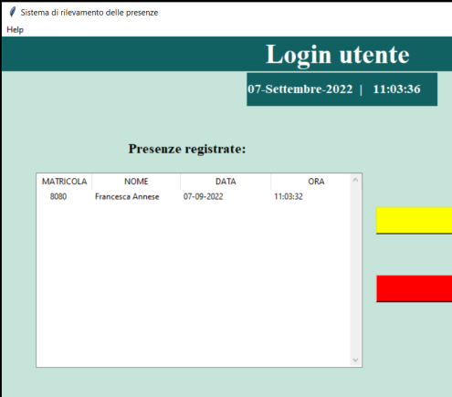

# Attendance-Tracking-System
System that keeps track of the presence of students in a class.  

## Prerequisiti 
Prima di far partire il sistema, è necessario aver installato alcune librerie e moduli:  
• **Python** scaricabile al seguente link: https://www.python.org/downloads/  
• **Anacona** (opzionale) scaricabile al seguente link: https://www.anaconda.com/products/distribution  
• Installazione di **OpenCV**: *pip install opencv-python*  
• Scaricare il **classificatore pre-addestrato** dal repository OpenCV: https://github.com/opencv/opencv e inserirlo all’interno della directory del progetto. Per implementare l’algoritmo del Sistema di Rilevamento delle Presenze è stata sfruttata la potenzialità della libreria OpenCV che implementa già uno degli algoritmi di classificazione più usati in questo contesto. Questo algoritmo permette sfruttare un classificatore pre ddestrato: **haarcascade_frontalface_default**. 
• Installazione dei seguenti **moduli**: 
- *pip install tk-tools*
- *pip install datetime*
- *pip install pytest-shutil*
- *pip install python-csv*
- *pip install numpy*
- *pip install pillow*
- *pip install pandas*
- *pip install times*

 
 Al fine di un corretto uso dell’applicazione è necessario essere in possesso di una semplice webcam, esterna o interna al pc.
  
  ## Istruzioni per l'avvio
  
- Apri il prompt dei comandi o Anaconda prompt
- *Cd C:\Users\Utente\Desktop\... \SistemaDiRilevamentoDellePresenze*
- *Pip install requirements.txt* (sono gli stessi menzionati nei prerequisiti)
- *Main.py*
 
## Come funziona il sistema
 
Appena avviato il sistema, si apre la pagina principale, un menù dove è possibile scegliere l’operazione da compiere, consultabile in ogni momento.  
  

Nel menù ci sono tre pulsanti:  

### 1) “COME FUNZIONA?”

Cliccando questo pulsante si apre una finestra che spiega all’utente le funzionalità del sistema e in che modo procedere in base alle proprie esigenze.  

  

### 2) “REGISTRATI”
Cliccando questo pulsante si accede alla pagina di registrazione nuovo utente.
  

La registrazione dell’utente deve essere fatta solo una volta, la prima volta che si accede al sistema. Per effettuare la registrazione è necessario essere a conoscenza della password per salvare un nuovo profilo utente. Se la password inserita non è corretta, viene mostrato un messaggio di errore.  
L’idea di inserire una password per questa funzionalità nasce pensando al contesto di applicazione nel sistema, quindi una scuola o una università prevalentemente. Da qui nasce la necessità di ridurre il rischio di compromissione del sistema attraverso l’inserimento di una password. 
L’utente che si sta registrando, deve inserire il proprio numero di Matricola ed il proprio Nome e Cognome. Questi dati nel momento del salvataggio, verranno salvati un file csv chiamato **StudentDetails.csv** all’interno della cartella StudentDetails. Se l’utente per errore non inserisce i propri dati, comparirà il seguente messaggio  
  
A questo punto si deve passare all’acquisizione delle immagini del proprio volto, quindi l’utente deve premere il pulsante 1) Acquisisci immagini e deve attendere l’apertura della schermata di acquisizione. Una volta aperta attendere qualche secondo davanti alla webcam mostrando il volto. Il sistema acquisirà 100 immagini del viso in qualche secondo.  

In base alle prestazioni del computer dal quale si avvia il programma potrebbe mettercivqualche secondo in più. Attendere sempre davanti la webcam. Al termine la schermata divchiuderà automaticamente.vDa notare che se il sistema non riesce a rilevare bene il volto per vari motivi, potrebbe rallentare fino a chiudersi. Le immagini appena acquisite verranno salvate nella cartella TrainingImage.  

Ora l’utente deve completare la registrazione cliccando sul pulsante 2) Salva Profilo. A questo punto della registrazione è necessario inserire la password per terminare l’operazione di registrazione. Sulla password inserita vengono effettuati tutti i controlli necessari. Se la password non è corretta viene mostrato un messaggio di errore.  

I dettagli dello studente che si è appena registrato, verranno automaticamente inseriti anche all’interno di un file csv chiamato StudentDetails.csv presente nella cartella StudentDetail del repository.  
Una volta salvato il profilo avviene il training delle immagini salvate nel dataset. Il modello risultante chiamato Trainner.yml verrà salvato nella cartella TrainingImageLabel.  

### 3) LOGIN
 
 Cliccando questo pulsante si accede alla pagina di Login Utente.  
   
 In questa pagina, l’utente già registrato precedentemente deve cliccare sul pulsante “Registra Presenza” per poter così registrare la sua presenza all’interno  dell’aula. Nel caso di primo utilizzo del sistema, se si prova ad effettuare il riconoscimento comparirà questo avviso:  
   
 Anche in questo caso, una volta cliccato sul pulsante, attendere qualche secondo davanti alla webcam mostrando il volto.  

Nel momento in cui il sistema riconosce il volto dell’utente, premere “Q” da tastiera per registrare la presenza e chiudere la schermata.  

Se l’utente che sta cercando di registrare la sua presenza nell’aula non è registrato, il sistema non riuscirà a riconoscere il suo volto e lo segnalerà come “Unknown”. Una volta premuto ‘Q’ da tastiera, non verrà registrata nessuna presenza e il sistema si chiuderà.

 La presenza verrà automaticamente inserita anche all’interno di un file csv chiamato Attendance_dd-mm-yy.csv presente nella cartella Attendance del repository.
Nella pagina, a sinistra, è possibile vedere in tempo reale nella tabella le presenze registrate.  
  
 Nel caso di molte presenze registrate, grazie alla barra di scorrimento laterale è possibile visualizzare tutte le presenze registrate, anche quelle meno recenti.  
   
 
 ### OSSERVAZIONI
• All’interno del sistema è sempre presente un menù a tendina “Help”, consultabile in ogni momento. Attraverso questo, è possibile modificare la password del sistema di registrazione; sono presenti i contatti utili ed è possibile chiudere il sistema.  
    
 
 Vediamo nel dettaglio le singole voci:
- Modifica Password: Consente in qualsiasi momento di modificare la password del sistema. Per farlo, occorre inserire la vecchia password per poi inserirne la nuova.
Sulla password, sia vecchia che nuova, sono effettuati tutti i controlli necessari.  
- Contatti: Consente di visualizzare dei contatti utili per aiuto o qualsiasi tipo di informazione.  
- Esci: Permette all’utente di chiudere l’applicazione in qualsiasi momento lo si voglia.  
 

• In tutte le pagine è presente il pulsante “BACK” che se cliccato riporta alla pagina principale dove è presente il menù con i pulsanti.
  

• Nella pagina di registrazione nuovo utente sono presenti i pulsanti “Cancella” che se premuti rimuovono il contenuto inserito dall’utente.
Sotto i pulsanti c’è una barra di avvisi, il contenuto del messaggio cambia in base all’operazione che si sta eseguendo o che si vuole eseguire.
   

In fondo alla pagina è presente una scritta che si aggiorna in tempo reale ogni qual volta viene registrato un nuovo utente.

Se è la prima volta che si utilizza il sistema è necessario impostare una password nel momento in cui si effettua il salvataggio. La password verrà memorizzata nella cartella TrainingImageLabel in un file di testo chiamato psd.txt.
 
 
 È possibile cambiare la password utilizzando il menù a tendina “Help”, come già detto, in ogni momento.
  

• Nella pagina di login utente, in alto, è possibile visualizzare la data e l’ora in tempo reale; la stessa che verrà visualizzata nella tabella delle presenze.

Premendo il pulsante “Esci” è possibile uscire dal sistema.
 
                                                                    
